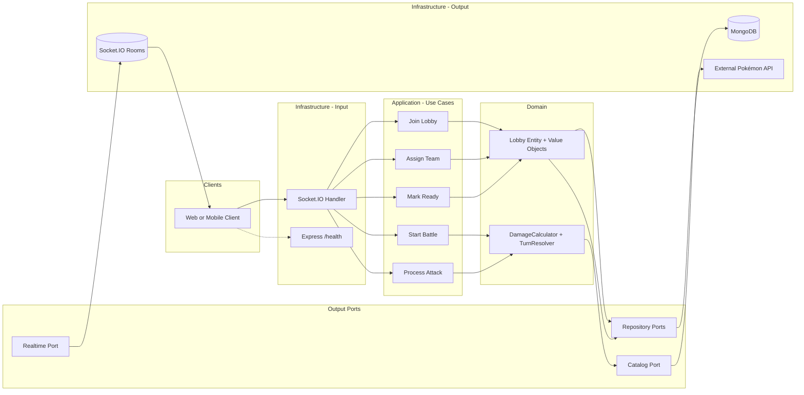

# Backend Architecture — PokePVP

This document describes the backend architecture: **hexagonal (ports and adapters)**, **event-driven** communication, **Clean Code**, and **SOLID** principles. The backend is built with **Express**, **MongoDB**, and **Socket.IO** for real-time communication.

---

## 1. Context and Constraints

- **Runtime:** Node.js 18+
- **Web framework:** Express (health check + middleware only — no game logic on REST)
- **Real-time:** All game flow (join, assign, ready, attack) goes through **Socket.IO**
- **Database:** MongoDB (non-relational), with authentication enabled in Docker
- **Server:** Must run locally on **port 8080** and listen on **0.0.0.0**

---

## 2. Hexagonal Architecture (Ports and Adapters)

The core of the application is the **domain**; all external concerns (HTTP, WebSockets, database, external APIs) are accessed through **ports** (interfaces) and **adapters** (concrete implementations).

### 2.1 Domain (Core)

The domain layer contains business logic with **no dependency** on Express, MongoDB, or any transport.

- **Entities:** Rich domain objects with behavior. `Lobby` is a class with methods like `isFull()`, `canJoin()`, `isEveryoneReady()`, `addPlayer()`, `markReady()`, and `withStatus()`. All state transitions return new immutable instances.
- **Value Objects:** `Nickname` encapsulates validation (type, trim, length). Constructed via `new Nickname(value)` — throws `ValidationError` on invalid input.
- **Domain Services:** Pure functions for domain logic that doesn't belong to a single entity:
  - `calculateDamage(attackStat, defenseStat)` — encapsulates the damage formula (`max(1, attack - defense)`)
  - `resolveFirstTurn({...})` — determines who acts first based on Speed with deterministic tiebreakers
- **Ports (`domain/ports/`):** Output port interfaces (e.g. `CatalogPort`, `LobbyRepository`, `RealtimePort`). The domain defines the contracts it needs; infrastructure implements them. This follows the dependency inversion principle.
- The domain does **not** import frameworks or infrastructure.

### 2.2 Application Layer (Use Cases)

- **Use cases** orchestrate flows: join lobby, rejoin lobby (post-MVP, for reconnection UX), assign Pokémon team, mark ready, start battle, process attack.
- Each use case receives only what it needs and **delegates business logic** to domain entities and services.
- The application layer depends on **abstractions** (ports), not concrete adapters.

### 2.3 Output Ports

- **Persistence:** Repository interfaces (`LobbyRepository`, `BattleRepository`, `PlayerRepository`, `TeamRepository`, `PokemonStateRepository`) for saving/loading domain objects.
- **External API:** `CatalogPort` interface for fetching the Pokémon catalog (list and detail) from the external API.
- **Real-time:** `RealtimePort` interface for sending events to connected clients (`lobby_status`, `battle_start`, `turn_result`, `battle_end`).

### 2.4 Input Adapters (Infrastructure Layer)

- **`infrastructure/http/`** — Express: only the `/health` endpoint remains. All game logic was moved to Socket.IO (the REST controllers for catalog and lobby were removed as dead/redundant code).
- **`infrastructure/socket/`** — Socket.IO handler: handles real-time events (`join_lobby`, `rejoin_lobby`, `assign_pokemon`, `ready`, `attack`) and delegates to use cases. Uses `wrapHandler()` for uniform error handling and `requirePlayerContext()` for authentication.

### 2.5 Output Adapters (Infrastructure Layer)

- **`infrastructure/persistence/`** — MongoDB implementations of repository interfaces. Uses `throwMappedError()` to translate Mongoose errors into domain errors.
- **`infrastructure/clients/`** — `PokeAPIAdapter` (class-based Anti-Corruption Layer): maps external API responses to a stable domain shape, includes in-memory cache with 10-minute TTL, and uses `AbortSignal.timeout(5000)` for all HTTP calls.
- **`infrastructure/socket/socketio.adapter.js`** — `SocketIOAdapter` implements `RealtimePort` using Socket.IO rooms.

---

## 3. Event-Driven Communication

- All game events flow through **Socket.IO**. The server emits `lobby_status`, `battle_start`, `turn_result`, and `battle_end` to the relevant room (one room per lobby).
- The `RealtimePort` interface decouples the application layer from Socket.IO specifics. Use cases call port methods like `notifyBattleStart(lobbyId, payload)` without knowing about rooms or sockets.
- **Turn processing** is atomic (one attack at a time) to avoid race conditions.
- **Player identity** is established via `join_lobby` (or restored via `rejoin_lobby` after a reconnect) and stored in `socket.data`. All subsequent events authenticate using this server-side context — payloads cannot override it.

---

## 4. Principles Applied

### SOLID

- **SRP:** Each use case and each adapter has a single, well-defined responsibility. The `SocketHandler` delegates to use cases (join lobby, rejoin lobby, assign team, mark ready, start battle, process attack) plus the realtime port.
- **OCP:** New behavior is added by new use cases or new adapters without changing existing core logic.
- **LSP:** Any implementation of a port can replace another (e.g. in-memory vs MongoDB repositories) without breaking callers.
- **ISP:** Ports are small and specific (e.g. "save battle", "notify lobby") rather than one large interface.
- **DIP:** Domain and application depend on **abstractions** (ports); infrastructure depends on and implements those abstractions. All wiring happens in `index.js`.

### Clean Code

- Clear naming (use cases, entities, ports) so intent is obvious.
- Small, focused functions and modules.
- Domain entities contain behavior — use cases orchestrate, they don't compute.
- Centralized error handling at the edge: `wrapHandler()` in Socket.IO, global middleware in Express.
- Consistent error imports from `application/errors/`.

---

## 5. Layers Diagram

---

## 6. Security

- **Player authentication:** Identity is established during `join_lobby` and stored in `socket.data`. All subsequent events (`assign_pokemon`, `ready`, `attack`) use `socket.data.playerId` and `socket.data.lobbyId` — never trusting payload values. `requirePlayerContext()` validates this on every event.
- **LobbyId spoofing prevention:** If the payload contains a `lobbyId` that doesn't match `socket.data.lobbyId`, the event is rejected with a `ValidationError`.
- **Input validation:** Nicknames are validated via the `Nickname` value object (max 30 chars, trimmed, non-empty). Schema-level `maxlength: 30` in MongoDB as defense in depth.
- **HTTP security:** `helmet` sets secure headers. `cors` restricts origins (configurable via `CORS_ORIGIN`). `express-rate-limit` applies a global limiter (100 req/15 min). `express.json({ limit: '10kb' })` prevents large payloads.
- **MongoDB authentication:** Docker Compose configures `MONGO_INITDB_ROOT_USERNAME` and `MONGO_INITDB_ROOT_PASSWORD`. Connection string includes auth credentials.
- **Log safety:** In production (`NODE_ENV=production`), error logs include only `[name] message` — no stack traces.

---

## 7. Error Handling

- **Domain/application errors:** `ValidationError` (400), `NotFoundError` (404), `ConflictError` (409) — each carries a `.status` property.
- **Infrastructure errors:** `InvalidConfigError` (500), `ThirdPartyApiFailedError` (504).
- **Socket.IO:** `wrapHandler()` catches all errors, emits an `error` event with `{ code, message }`, and calls `safeAck()` which prevents serialization crashes.
- **Express:** Global error middleware maps `err.status ?? 500` to HTTP responses.
- **MongoDB:** `throwMappedError()` translates Mongoose `ValidationError`, `CastError`, and duplicate key errors into domain errors.

---

## 8. Configuration and Environment

All environment-dependent values come from **environment variables**:

| Variable | Description | Default |
|----------|-------------|---------|
| `PORT` | Server port | `8080` |
| `POKEAPI_BASE_URL` | External Pokémon API URL | (required) |
| `MONGODB_URI` | MongoDB connection string with auth | (required) |
| `MONGO_PASSWORD` | MongoDB root password (Docker) | `devpassword` |
| `MONGO_HOST_PORT` | Host port mapped to MongoDB | `27017` |
| `CORS_ORIGIN` | Allowed CORS origin | `http://localhost:3000` |
| `NODE_ENV` | Environment (`production` / `development`) | (unset) |

---

## 9. Persistence

- **Database:** MongoDB with Mongoose ODM.
- **Entities persisted:** Player, Lobby, Team, Battle, PokemonState.
- **Repository interfaces** are defined in `domain/ports/`; MongoDB implementations live in `infrastructure/persistence/mongodb/adapters/`.
- **Graceful shutdown:** On `SIGTERM`/`SIGINT`, the server closes Socket.IO, HTTP connections, and MongoDB before exiting. Force-exit after 10 seconds.

---

## 10. Scalability Limitations (MVP)

### SCALE-1 — Socket.IO Without Adapter for Horizontal Scaling

Socket.IO stores room and connection state in memory. If the server scales to multiple instances behind a load balancer, events won't reach all clients because rooms are local to each instance.

**When needed:** Use `@socket.io/redis-adapter` or `@socket.io/redis-streams-adapter` to share state across instances. This requires a Redis instance and sticky sessions at the load balancer.

### SCALE-2 — findActive() Returns Only One Lobby

`lobbyRepository.findActive()` returns a single lobby (the most recent non-finished one). This limits the system to one concurrent game at a time.

**When needed:** Implement a matchmaking queue or allow `findActive()` to return multiple lobbies. Players would be matched by criteria (rating, region, etc.) instead of joining the single active lobby.

Both limitations are **intentional for the MVP** and documented here for future reference.

---

For detailed business rules (catalog, team selection, battle flow, damage, events, persistence), see **[business-rules.md](business-rules.md)**.
